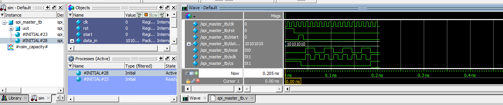
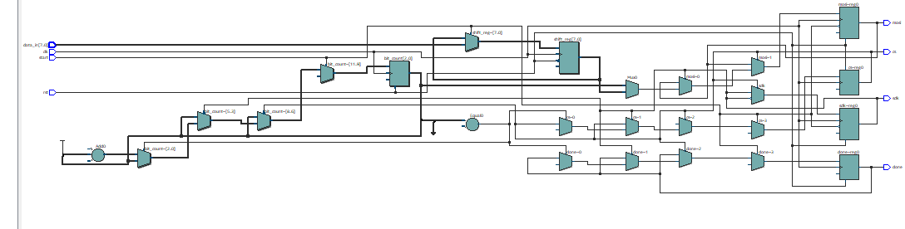
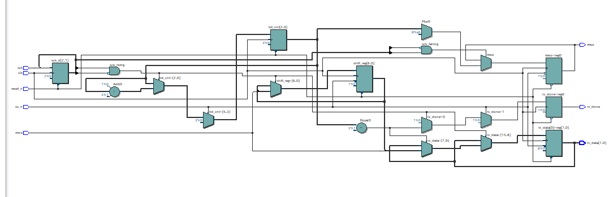
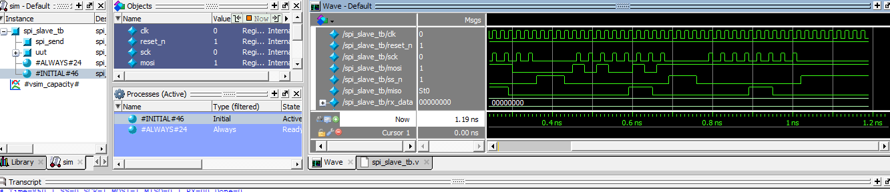

# 🚀 SPI Master-Slave Verilog

  

  
  
  

---

# 📖 Project Overview

This project implements SPI Master-Slave Communication using Verilog HDL.

---

# 🧩 SPI Master RTL

---

# 📊 SPI Master Waveform

---

# 🧩 SPI Slave RTL

---

# 📊 SPI Slave Waveform

---

## 🛠 Tools Used
- Verilog HDL
- Intel Quartus Prime
- ModelSim

## 👩‍💻 Author
**Madhumitha**
